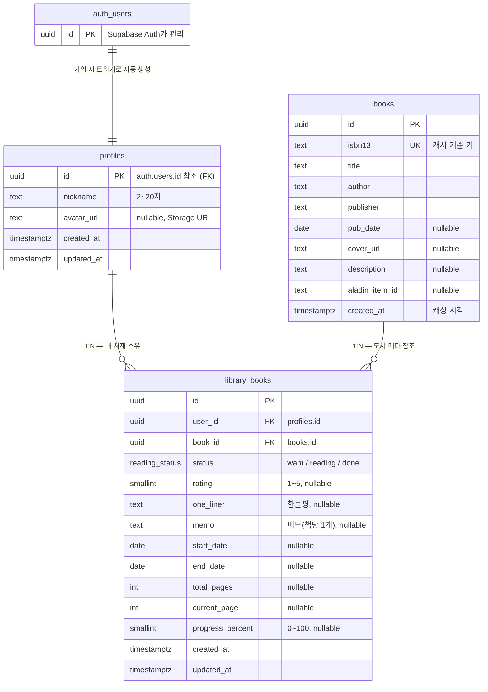

# 북박이장(BookJjang) 프로토타입 DB 설계서

**과제**: 나만의 메인 서비스에서 활용될 프로토타입 DB 설계하기
**서비스**: 북박이장 — 개인 독서 기록 서비스 (검색 → 서재 추가 → 독서 기록 → 통계)
**작성자**: lhank0103
**작성일**: 2026-07-08
**스택**: Supabase (PostgreSQL) · Supabase Auth (구글 OAuth) · Supabase Storage

---

## 1. 개요 및 설계 원칙

| 원칙 | 내용 |
|------|------|
| 인증 위임 | 구글 OAuth는 Supabase Auth가 처리. 가입 시 `auth.users`에 자동 생성되고, 트리거로 `profiles`가 자동 생성됨 |
| 보안 | 모든 사용자 데이터는 **RLS(Row Level Security)**로 본인만 접근 가능하도록 강제 |
| 중복 방지 | 도서 메타는 알라딘 API 응답을 **ISBN13 기준 1회 캐싱**(`books`) — 사용자 간 중복 저장 없음. 서재는 `(user_id, book_id)` 유니크로 같은 책 중복 추가 방지 |
| 최소 설계 | 테이블 3개(`profiles` / `books` / `library_books`)로 MVP 전 기능(검색·서재·기록·통계)을 커버 |

---

## 2. ERD



- `profiles` 1 : N `library_books` — 사용자가 서재에 담은 책들
- `books` 1 : N `library_books` — 여러 사용자가 같은 도서 메타를 공유
- `library_books`는 `(user_id, book_id)` **UNIQUE** → 같은 책 중복 추가 방지

---

## 3. 테이블 명세

### 3.1 `profiles` — 사용자 프로필

| 컬럼 | 타입 | 제약 | 설명 |
|------|------|------|------|
| id | uuid | PK, FK→auth.users.id | 가입 시 트리거로 자동 생성 |
| nickname | text | NOT NULL, 2~20자 CHECK | 별명 (기본값: 구글 이름) |
| avatar_url | text | nullable | 프로필 이미지 URL (Storage) |
| created_at | timestamptz | NOT NULL, default now() | 생성 시각 |
| updated_at | timestamptz | NOT NULL, 트리거 자동 갱신 | 수정 시각 |

### 3.2 `books` — 도서 메타 캐시 (알라딘 API)

| 컬럼 | 타입 | 제약 | 설명 |
|------|------|------|------|
| id | uuid | PK, default gen_random_uuid() | 내부 식별자 |
| isbn13 | text | UNIQUE, NOT NULL | ISBN13 (캐시 기준 키) |
| title | text | NOT NULL | 제목 |
| author | text | nullable | 저자 |
| publisher | text | nullable | 출판사 |
| pub_date | date | nullable | 출간일 |
| cover_url | text | nullable | 표지 이미지 URL |
| description | text | nullable | 소개 |
| aladin_item_id | text | nullable | 알라딘 상품 ID |
| created_at | timestamptz | NOT NULL, default now() | 캐싱 시각 |

### 3.3 `library_books` — 내 서재의 책 1권 = 독서 기록

| 컬럼 | 타입 | 제약 | 설명 |
|------|------|------|------|
| id | uuid | PK, default gen_random_uuid() | 식별자 |
| user_id | uuid | FK→profiles.id, NOT NULL, on delete cascade | 소유자 |
| book_id | uuid | FK→books.id, NOT NULL, on delete restrict | 도서 |
| status | reading_status | NOT NULL, default 'reading' | `want` / `reading` / `done` |
| rating | smallint | CHECK 1~5, nullable | 별점 (정수) |
| one_liner | text | nullable | 한줄평 |
| memo | text | nullable | 메모 (책당 1개) |
| start_date | date | nullable | 독서 시작일 |
| end_date | date | nullable | 독서 완료일 |
| total_pages | int | CHECK ≥ 0, nullable | 전체 페이지 |
| current_page | int | CHECK ≥ 0, nullable | 현재 페이지 |
| progress_percent | smallint | CHECK 0~100, nullable | 진행률 직접 입력값 |
| created_at | timestamptz | NOT NULL, default now() | 서재 추가 시각 |
| updated_at | timestamptz | NOT NULL, 트리거 자동 갱신 | 수정 시각 |
| — | — | **UNIQUE (user_id, book_id)** | 같은 책 중복 추가 방지 |

> 진행률은 `current_page / total_pages` 계산 또는 `progress_percent` 직접 입력 두 방식을 모두 허용(둘 중 있는 값 사용). 상태가 `done`이면 UI에서 100% 표시.

---

## 4. DDL (SQL)

```sql
-- 0) 확장 & enum
create extension if not exists "pgcrypto";           -- gen_random_uuid()
create type reading_status as enum ('want', 'reading', 'done');

-- 1) profiles
create table public.profiles (
  id          uuid primary key references auth.users(id) on delete cascade,
  nickname    text not null check (char_length(nickname) between 2 and 20),
  avatar_url  text,
  created_at  timestamptz not null default now(),
  updated_at  timestamptz not null default now()
);

-- 2) books (알라딘 메타 캐시)
create table public.books (
  id             uuid primary key default gen_random_uuid(),
  isbn13         text unique not null,
  title          text not null,
  author         text,
  publisher      text,
  pub_date       date,
  cover_url      text,
  description    text,
  aladin_item_id text,
  created_at     timestamptz not null default now()
);

-- 3) library_books (내 서재 = 독서 기록)
create table public.library_books (
  id               uuid primary key default gen_random_uuid(),
  user_id          uuid not null references public.profiles(id) on delete cascade,
  book_id          uuid not null references public.books(id) on delete restrict,
  status           reading_status not null default 'reading',
  rating           smallint check (rating between 1 and 5),
  one_liner        text,
  memo             text,
  start_date       date,
  end_date         date,
  total_pages      int check (total_pages >= 0),
  current_page     int check (current_page >= 0),
  progress_percent smallint check (progress_percent between 0 and 100),
  created_at       timestamptz not null default now(),
  updated_at       timestamptz not null default now(),
  unique (user_id, book_id)
);

create index on public.library_books (user_id, status);
create index on public.library_books (user_id, created_at desc);
```

---

## 5. RLS 정책 (보안)

```sql
alter table public.profiles      enable row level security;
alter table public.library_books enable row level security;
alter table public.books         enable row level security;

-- profiles: 본인 것만 조회/수정
create policy "profiles_select_own" on public.profiles
  for select using (auth.uid() = id);
create policy "profiles_upsert_own" on public.profiles
  for insert with check (auth.uid() = id);
create policy "profiles_update_own" on public.profiles
  for update using (auth.uid() = id);

-- library_books: 본인 데이터만 CRUD
create policy "library_all_own" on public.library_books
  for all using (auth.uid() = user_id) with check (auth.uid() = user_id);

-- books: 로그인 사용자는 읽기 가능, 추가는 인증된 사용자 가능(서재 추가 시 upsert)
create policy "books_select_auth" on public.books
  for select to authenticated using (true);
create policy "books_insert_auth" on public.books
  for insert to authenticated with check (true);
```

> 운영 안전성을 높이려면 `books` 쓰기를 서버(Service Role)로 제한하고, 알라딘 프록시 API 라우트에서만 upsert 하도록 개선 가능.

---

## 6. 자동화 (트리거)

```sql
-- 신규 가입 시 profiles 자동 생성 (구글 이름을 기본 별명으로)
create or replace function public.handle_new_user()
returns trigger language plpgsql security definer as $$
begin
  insert into public.profiles (id, nickname)
  values (new.id, coalesce(new.raw_user_meta_data->>'name', '독서가'));
  return new;
end; $$;

create trigger on_auth_user_created
  after insert on auth.users
  for each row execute function public.handle_new_user();

-- updated_at 자동 갱신
create or replace function public.touch_updated_at()
returns trigger language plpgsql as $$
begin new.updated_at = now(); return new; end; $$;

create trigger trg_profiles_touch      before update on public.profiles      for each row execute function public.touch_updated_at();
create trigger trg_library_books_touch before update on public.library_books for each row execute function public.touch_updated_at();
```

---

## 7. 대표 쿼리 (통계 화면)

```sql
-- 총 읽은 권수 / 읽는 중 / 평균 별점
select
  count(*) filter (where status = 'done')            as total_done,
  count(*) filter (where status = 'reading')         as total_reading,
  round(avg(rating)::numeric, 1)                     as avg_rating
from public.library_books
where user_id = auth.uid();

-- 최근 12개월 월별 완독 권수
select to_char(date_trunc('month', end_date), 'YYYY-MM') as month,
       count(*) as done_count
from public.library_books
where user_id = auth.uid() and status = 'done' and end_date is not null
  and end_date >= (current_date - interval '12 months')
group by 1 order by 1;
```

---

## 8. Storage (프로필 이미지)

- 버킷: `avatars` (public read 또는 signed URL)
- 경로 규칙: `avatars/{user_id}.{ext}` — 사용자당 1장 덮어쓰기
- 제약: JPG/PNG, 최대 2MB, 정사각형 크롭 후 업로드
