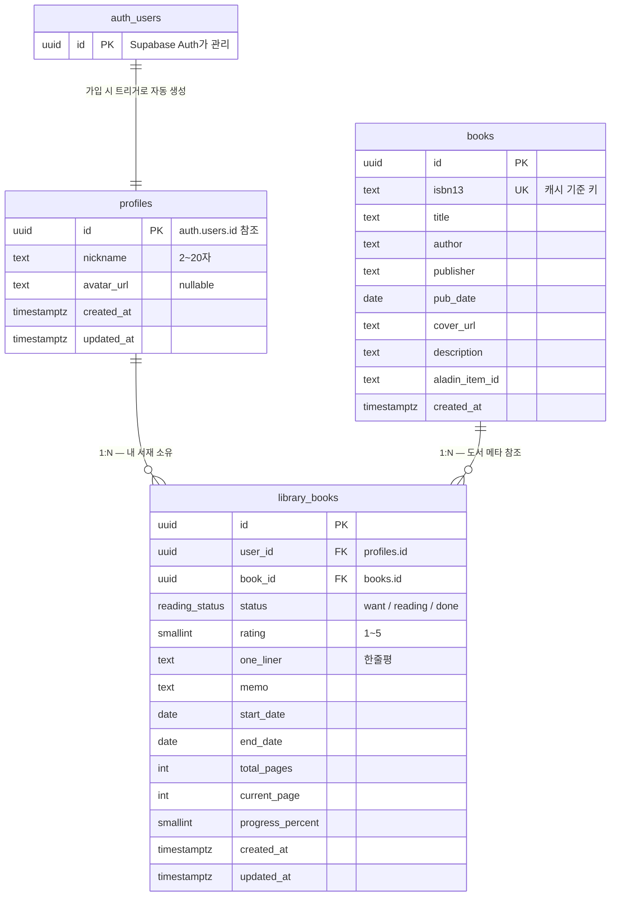

# 북박이장 (BookJjang) 📚

> 개인 독서 기록 서비스 — 책 검색 → 서재 추가 → 독서 기록 → 통계

**과제**: 나만의 메인 서비스에서 활용될 프로토타입 DB 설계하기
**작성자**: lhank0103

설계서만 쓰고 끝내지 않고, **실제로 Supabase에 DB를 구축하고 서비스와 연결해 배포까지** 했습니다.

| | |
|---|---|
| 🌐 **배포된 서비스** | **https://book-jjang.vercel.app** |
| 📄 **DB 설계서 (과제 산출물)** | [`05-bookjjang-db/01-db-design.md`](05-bookjjang-db/01-db-design.md) |
| 🗄️ **실제 실행한 스키마** | [`web/supabase/schema.sql`](web/supabase/schema.sql) |
| 💻 **웹 서비스 코드** | [`web/`](web/) — Next.js 16 + Supabase |

---

## ERD



## 설계 원칙

| 원칙 | 내용 |
|------|------|
| **최소 설계** | 테이블 3개로 MVP 전 기능(검색·서재·기록·통계)을 커버 |
| **중복 방지** | 도서 메타는 알라딘 API 응답을 **ISBN13 기준 1회만 캐싱**(`books`) — 사용자가 늘어도 같은 책은 한 번만 저장. 서재는 `(user_id, book_id)` UNIQUE로 같은 책 중복 추가 차단 |
| **보안** | 모든 사용자 데이터에 **RLS(Row Level Security)** 적용 — 본인 것만 읽고 쓸 수 있음 |
| **인증 위임** | 구글 OAuth는 Supabase Auth가 처리. 가입 시 트리거가 `profiles`를 자동 생성 |

## 구현 현황

- ✅ **책 검색** — 알라딘 Open API 실시간 연동 (TTB 키는 서버에서만 사용)
- ✅ **서재 추가** — 검색 결과를 `books` 캐싱 후 `library_books`에 추가
- ✅ **독서 기록** — 상태 / 별점 / 한줄평 / 메모 / 진행률 저장
- ✅ **통계** — 완독 권수, 읽는 중, 평균 별점, 월별 완독 그래프
- ⬜ **구글 로그인** — 미구현 (스키마와 RLS는 준비 완료)

로그인 UI가 없는 동안에도 **RLS를 끄거나 우회하지 않았습니다.** 서버에서 데모 계정으로 로그인해 정상적인 `auth.uid()`를 얻는 방식이라, RLS 정책이 설계된 그대로 작동합니다. 앱은 공개 키(anon)만 사용하고, RLS를 무시하는 `service_role` 키는 앱 코드에 등장하지 않습니다.

## RLS 동작 검증

| 시나리오 | 결과 |
|---|---|
| 로그인 없이 서재 조회 | **0행** — 차단 |
| 본인 계정으로 조회 | **7행** — 통과 |
| 남의 데이터 수정 시도 | **0행 변경** — 차단 |

## 실행 방법

```bash
cd web
npm install
cp .env.local.example .env.local   # Supabase URL / anon key / 알라딘 TTB 키 입력
```

Supabase 대시보드 SQL Editor에 [`web/supabase/schema.sql`](web/supabase/schema.sql)을 붙여넣고 실행한 뒤:

```bash
node scripts/seed.mjs   # 데모 계정 + 샘플 도서 7권 (service_role 키 필요, 1회성)
npm run dev             # http://localhost:3000
```

> `scripts/seed.mjs`는 초기 데이터 투입 전용이며 앱 코드에서 import되지 않습니다.
> 시드가 끝나면 `.env.local`의 `SUPABASE_SERVICE_ROLE_KEY`를 비워도 앱은 정상 동작합니다.

## 기술 스택

**Next.js 16** (App Router, Server Actions) · **Supabase** (PostgreSQL / Auth / RLS) · **TypeScript** · **Tailwind CSS 4** · **Recharts** · **알라딘 Open API**

## 폴더 구조

```
├── 01-bookjjang/               기획 (PRD, IA, 데이터 모델, 백로그)
├── 02-bookjjang_design-system/ 디자인 시스템
├── 03-bookjjang-hi-fi/         하이파이 시안
├── 04-bookjjang-design-md/     디자인 문서화 (DESIGN.md)
├── 05-bookjjang-db/            📄 DB 설계서 (과제 산출물)
├── web/                        💻 Next.js 웹 서비스
│   ├── supabase/schema.sql       실제 실행한 DDL + RLS + 트리거
│   ├── scripts/seed.mjs          초기 시드 (1회성)
│   └── src/
│       ├── lib/queries.ts        서재 조회 / 통계 집계
│       ├── lib/supabase/         Supabase 클라이언트
│       └── app/                  화면 + Server Actions
└── 스크린샷/                    화면 캡처
```
